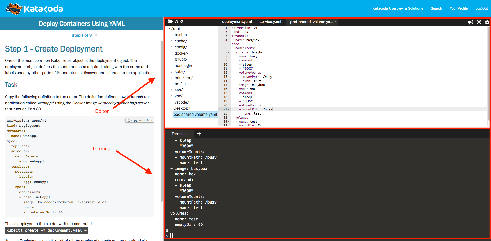
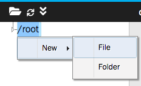

# Lab 03 - Using Statefulset

We use [KataCota](https://www.katacoda.com/) as playground.

This lab is on the environment: [Deploy Containers Using YAML](https://www.katacoda.com/courses/kubernetes/creating-kubernetes-yaml-definitions).

Click "START SCENARIO". We will have __One Hour__ lab environment. After __Onre Hour__, we have to refresh browser to get new environment.

The environment provide We need the editor and terminal. We need to wait the minibuke ready.

```
minikube start --wait=false
$
$ minikube start --wait=false
* minikube v1.8.1 on Ubuntu 18.04
* Using the none driver based on user configuration
* Running on localhost (CPUs=2, Memory=2460MB, Disk=145651MB) ...
* OS release is Ubuntu 18.04.4 LTS
* Preparing Kubernetes v1.17.3 on Docker 19.03.6 ...
  - kubelet.resolv-conf=/run/systemd/resolve/resolv.conf
* Launching Kubernetes ...
* Enabling addons: default-storageclass, storage-provisioner
* Configuring local host environment ...
* Done! kubectl is now configured to use "minikube"
```

The lab environemnt screenshot:




We can click mouse right on the `/root` to create new files:



## Deploy StatefulSet

Create a new file `statefulset.yaml`

```
apiVersion: apps/v1
kind: StatefulSet
metadata:
  name: web
spec:
  serviceName: "nginx"
  replicas: 1
  selector:
    matchLabels:
      app: nginx
  template:
    metadata:
      labels:
        app: nginx
    spec:
      containers:
      - name: nginx
        image: k8s.gcr.io/nginx-slim:0.8
        ports:
        - containerPort: 80
          name: web
        volumeMounts:
        - name: www
          mountPath: /usr/share/nginx/html
  volumeClaimTemplates:
  - metadata:
      name: www
    spec:
      accessModes: [ "ReadWriteOnce" ]
      resources:
        requests:
          storage: 1Gi
```

Deploy Statefulset.

```
kubectl apply -f statefulset.yaml
```

Check status.

- StatefulSet
- Pod
- Persistent Volume Claim and Persistent Volume

```
kubectl get statefulset,pods,persistentvolumeclaim,persistentvolume
```

We should get output like:

```
NAME                   READY   AGE
statefulset.apps/web   1/1     7m32s

NAME        READY   STATUS    RESTARTS   AGE
pod/web-0   1/1     Running   0          7m32s

NAME                              STATUS   VOLUME                                     CAPACITY   ACCESS MODES   STORAGECLASS   AGE
persistentvolumeclaim/www-web-0   Bound    pvc-4a369cde-96aa-4160-b35f-85bee9b2e353   1Gi        RWO            standard       7m32s

NAME                                                        CAPACITY   ACCESS MODES   RECLAIM POLICY   STATUS   CLAIM               STORAG
ECLASS   REASON   AGE
persistentvolume/pvc-4a369cde-96aa-4160-b35f-85bee9b2e353   1Gi        RWO            Delete           Bound    default/www-web-0   standa
rd                7m31s
```

See detail of statefulset

```
kubectl get pod web-0 -o yaml
```

We should get output like:

```
...
  hostname: web-0
  nodeName: minikube
  priority: 0
  restartPolicy: Always
  schedulerName: default-scheduler
  securityContext: {}
  serviceAccount: default
  serviceAccountName: default
  subdomain: nginx
...
```

## Scale

Scale replicas to 3.

```
kubectl scale statefulset web --replicas=3
```

Check status.

- StatefulSet
- Pod
- Persistent Volume Claim and Persistent Volume

```
kubectl get statefulset,pods,persistentvolumeclaim,persistentvolume
```

We should get output like:

```
NAME                   READY   AGE
statefulset.apps/web   3/3     13m

NAME        READY   STATUS    RESTARTS   AGE
pod/web-0   1/1     Running   0          13m
pod/web-1   1/1     Running   0          21s
pod/web-2   1/1     Running   0          17s

NAME                              STATUS   VOLUME                                     CAPACITY   ACCESS MODES   STORAGECLASS   AGE
persistentvolumeclaim/www-web-0   Bound    pvc-4a369cde-96aa-4160-b35f-85bee9b2e353   1Gi        RWO            standard       13m
persistentvolumeclaim/www-web-1   Bound    pvc-7d2d0d48-3878-422a-a585-3211c36f44cd   1Gi        RWO            standard       21s
persistentvolumeclaim/www-web-2   Bound    pvc-27161f95-4db9-46d1-a18c-5a1caf416706   1Gi        RWO            standard       17s

NAME                                                        CAPACITY   ACCESS MODES   RECLAIM POLICY   STATUS   CLAIM               STORAGECLASS   REASON   AGE
persistentvolume/pvc-27161f95-4db9-46d1-a18c-5a1caf416706   1Gi        RWO            Delete           Bound    default/www-web-2   standard                17s
persistentvolume/pvc-4a369cde-96aa-4160-b35f-85bee9b2e353   1Gi        RWO            Delete           Bound    default/www-web-0   standard                13m
persistentvolume/pvc-7d2d0d48-3878-422a-a585-3211c36f44cd   1Gi        RWO            Delete           Bound    default/www-web-1   standard                21s
```

Scale replicas to 2.

```
kubectl scale statefulset web --replicas=2
```

We should get output like:

Check status.

```
kubectl get statefulset,pods,persistentvolumeclaim,persistentvolume
```

We should get output like:

```
NAME                   READY   AGE
statefulset.apps/web   2/2     14m

NAME        READY   STATUS    RESTARTS   AGE
pod/web-0   1/1     Running   0          14m
pod/web-1   1/1     Running   0          84s

NAME                              STATUS   VOLUME                                     CAPACITY   ACCESS MODES   STORAGECLASS   AGE
persistentvolumeclaim/www-web-0   Bound    pvc-4a369cde-96aa-4160-b35f-85bee9b2e353   1Gi        RWO            standard       14m
persistentvolumeclaim/www-web-1   Bound    pvc-7d2d0d48-3878-422a-a585-3211c36f44cd   1Gi        RWO            standard       84s
persistentvolumeclaim/www-web-2   Bound    pvc-27161f95-4db9-46d1-a18c-5a1caf416706   1Gi        RWO            standard       80s

NAME                                                        CAPACITY   ACCESS MODES   RECLAIM POLICY   STATUS   CLAIM               STORAGECLASS   REASON   AGE
persistentvolume/pvc-27161f95-4db9-46d1-a18c-5a1caf416706   1Gi        RWO            Delete           Bound    default/www-web-2   standard                80s
persistentvolume/pvc-4a369cde-96aa-4160-b35f-85bee9b2e353   1Gi        RWO            Delete           Bound    default/www-web-0   standard                14m
persistentvolume/pvc-7d2d0d48-3878-422a-a585-3211c36f44cd   1Gi        RWO            Delete           Bound    default/www-web-1   standard                84s
```

We can find that the web-03 Persistent Volume Claim and Persistent Volume are still be there.

## Headless service

Create a new file `statefulset-svc.yaml`

```
apiVersion: v1
kind: Service
metadata:
  name: nginx
  labels:
    app: nginx
spec:
  ports:
  - port: 80
    name: web
  clusterIP: None
  selector:
    app: nginx
```

Deploy headless service.

```
kubectl create -f statefulset-svc.yaml
```

Check the DNS records in kubernetes cluster.

```
kubectl run -it --image busybox:1.28 dns-test --restart=Never --rm /bin/sh

/ # nslookup nginx
```

We should get output like:

```
Server:    10.96.0.10
Address 1: 10.96.0.10 kube-dns.kube-system.svc.cluster.local

Name:      nginx
Address 1: 172.18.0.5 web-1.nginx.default.svc.cluster.local
Address 2: 172.18.0.4 web-0.nginx.default.svc.cluster.local
```

We try lookup the FQDN directory.

```
/ # nslookup web-0.nginx
```

We should get output like:

```
Server:    10.96.0.10
Address 1: 10.96.0.10 kube-dns.kube-system.svc.cluster.local

Name:      web-0.nginx
Address 1: 172.18.0.4 web-0.nginx.default.svc.cluster.local
```

Exit from dns-test pod.

```
/# exit
```

## Delete pods

Add file to statefulset
```
kubectl exec web-0 -- sh -c 'echo "Welcome to $(hostname)" > /usr/share/nginx/html/index.html'
kubectl exec web-1 -- sh -c 'echo "Welcome to $(hostname)" > /usr/share/nginx/html/index.html'
```

Delete all running pods.

```
kubectl delete pod -l app=nginx
```

Check the DNS records.

```
kubectl run -it --image busybox:1.28 dns-test --restart=Never --rm /bin/sh

/ # nslookup nginx
```

We should get output like:

```
Server:    10.96.0.10
Address 1: 10.96.0.10 kube-dns.kube-system.svc.cluster.local

Name:      nginx
Address 1: 172.18.0.5 web-1.nginx.default.svc.cluster.local
Address 2: 172.18.0.4 web-0.nginx.default.svc.cluster.local
```

Test http request to `web-0`.

```
/ # wget -qO- web-0.nginx
```

We should get output like:

```
Welcome to web-0
```

Test http request to `web-1`.

```
/ # wget -qO- web-1.nginx
```

```
Welcome to web-1
```

Exit from dns-test pod.

```
/ # exit
```

## Clean

```
kubectl delete -f statefulset-svc.yaml
kubectl delete -f statefulset.yaml
kubectl delete pvc -l app=nginx
```
