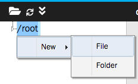

# Lab 04 - Using Job

We use [KataCota](https://www.katacoda.com/) as playground.

This lab is on the environment: [Deploy Containers Using YAML](https://www.katacoda.com/courses/kubernetes/creating-kubernetes-yaml-definitions).

Click "START SCENARIO". We will have __One Hour__ lab environment. After __Onre Hour__, we have to refresh browser to get new environment.

The environment provide We need the editor and terminal. We need to wait the minibuke ready.

```
minikube start --wait=false
$
$ minikube start --wait=false
* minikube v1.8.1 on Ubuntu 18.04
* Using the none driver based on user configuration
* Running on localhost (CPUs=2, Memory=2460MB, Disk=145651MB) ...
* OS release is Ubuntu 18.04.4 LTS
* Preparing Kubernetes v1.17.3 on Docker 19.03.6 ...
  - kubelet.resolv-conf=/run/systemd/resolve/resolv.conf
* Launching Kubernetes ...
* Enabling addons: default-storageclass, storage-provisioner
* Configuring local host environment ...
* Done! kubectl is now configured to use "minikube"
```

The lab environemnt screenshot:


We can click mouse right on the `/root` to create new files:



## Deploy Job

Create a new file `job.yaml`

```
apiVersion: batch/v1
kind: Job
metadata:
  name: pi
spec:
  template:
    spec:
      containers:
      - name: pi
        image: perl
        command: ["perl",  "-Mbignum=bpi", "-wle", "print bpi(2000)"]
      restartPolicy: Never
  completions: 1
  parallelism: 1
  backoffLimit: 4
```

Deploy Job.

```
kubectl apply -f job.yaml
```

Check Job status.

```
kubectl get jobs
```

We should get output like:

```
NAME   COMPLETIONS   DURATION   AGE
pi     0/1           12s        12s
```

Check Pod status.

```
kubectl get pods
```

We should get output like:

```
NAME       READY   STATUS      RESTARTS   AGE
pi-7ln25   0/1     Completed   0          68s
```

## Change completions

In other terminal

```
kubectl get po -w
```

Edit `job.yaml`, we modify the `completions`

```
apiVersion: batch/v1
kind: Job
metadata:
  name: pi
spec:
  template:
    spec:
      containers:
      - name: pi
        image: perl
        command: ["perl",  "-Mbignum=bpi", "-wle", "print bpi(2000)"]
      restartPolicy: Never
  completions: 5
  parallelism: 1
  backoffLimit: 4
```

Redeploy Job.

```
kubectl delete -f job.yaml
kubectl apply -f job.yaml
```

We check the Pod status in other terminal. There're 5 times `ContainerCreating`.

`Crtl + c` in other terminal to stop watch.

## Change parallelism

In other terminal

```
watch kubectl get po
```

Edit `job.yaml`, we modify the `completions`, `parallelism`

```
apiVersion: batch/v1
kind: Job
metadata:
  name: pi
spec:
  template:
    spec:
      containers:
      - name: pi
        image: perl
        command: ["perl",  "-Mbignum=bpi", "-wle", "print bpi(2000)"]
      restartPolicy: Never
  completions: 10
  parallelism: 3
  backoffLimit: 4
```

Redeploy Job.

```
kubectl delete -f job.yaml
kubectl apply -f job.yaml
```

Watch the Pod status in other terminal. There're 3 Pod running in the same time.

`Crtl + c` in other terminal to stop watch.

Delete Job.

```
kubectl delete -f job.yaml
```

## Deploy CronJob

Create a new file `cronjob.yaml`

```
apiVersion: batch/v1beta1
kind: CronJob
metadata:
  name: reporting-cron-job
spec:
  schedule: "*/1 * * * *"
  jobTemplate:
    spec:
      completions: 3
      parallelism: 3
      template:
        spec:
          containers:
            - name: busybox
              image: busybox
              command: ['expr', '3', '+', '2']
          restartPolicy: Never
```

Deploy CronJob.

```
kubectl apply -f cronjob.yaml
```

Watch the Pod status.

```
watch kubectl get pods
```

Wait 3 minutes. `Crtl + c` to stop watch.

Delete CronJob

```
kubectl delete -f cronjob.yaml
```
