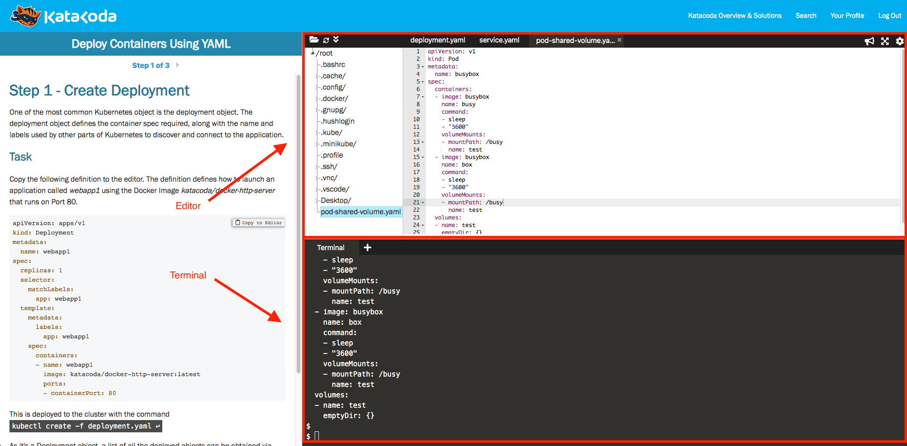

# Lab 09 - Troubleshooting

We use [KataCota](https://www.katacoda.com/) as playground.

This lab is on the environment: [Deploy Containers Using YAML](https://www.katacoda.com/courses/kubernetes/creating-kubernetes-yaml-definitions).

Click "START SCENARIO". We will have __One Hour__ lab environment. After __Onre Hour__, we have to refresh browser to get new environment.

The environment provide We need the editor and terminal. We need to wait the minibuke ready.

```
minikube start --wait=false
$
$ minikube start --wait=false
* minikube v1.8.1 on Ubuntu 18.04
* Using the none driver based on user configuration
* Running on localhost (CPUs=2, Memory=2460MB, Disk=145651MB) ...
* OS release is Ubuntu 18.04.4 LTS
* Preparing Kubernetes v1.17.3 on Docker 19.03.6 ...
  - kubelet.resolv-conf=/run/systemd/resolve/resolv.conf
* Launching Kubernetes ...
* Enabling addons: default-storageclass, storage-provisioner
* Configuring local host environment ...
* Done! kubectl is now configured to use "minikube"
```

The lab environemnt screenshot:




We can click mouse right on the `/root` to create new files:


## Lab Target

```
L4 Load Balancer -> Service -> Deployment -> Pod Nginx -> ConfigMap
```

We can send http request to L4 Load Balancer and get response: `Hello World!!!`.

## Minikube Tunnel

Run tunnel.

```
minikube tunnel
```

Ref: https://github.com/kubernetes/minikube/blob/master/site/content/en/docs/Tasks/loadbalancer.md

## Deploy a failed application

Create new terminal.

Clone source code.

```
git clone https://github.com/CloudMile/kubernetes-lab-advance.git
cd failed-app
```

Deploy all.

```
kubectl apply -f .
```

## Problem 01

There's no External IP of service `helloweb-lb`.

Get service info.

```
kubectl get services
```

We should get output like:

```
NAME          TYPE        CLUSTER-IP     EXTERNAL-IP   PORT(S)    AGE
helloweb-lb   ClusterIP   10.110.71.15   <none>        80/TCP     2m30s
kubernetes    ClusterIP   10.96.0.1      <none>        443/TCP    4m27s
```

<details>
  <summary>How to fix it?</summary>

Edit `service.yaml`, add `type: LoadBalancer`.

```
apiVersion: v1
kind: Service
metadata:
  name: helloweb-lb
spec:
  selector:
    app: notfound
  ports:
  - port: 80
    targetPort: 8080
    protocol: TCP
  type: LoadBalancer
```

Update service.

```
kubectl apply -f service.yaml
```

Get External IP of service `helloweb-lb`.

```
kubectl get services
```

We should get output like:

```
NAME          TYPE           CLUSTER-IP     EXTERNAL-IP    PORT(S)          AGE
helloweb-lb   LoadBalancer   10.110.71.15   10.110.71.15   80:32064/TCP     25m
kubernetes    ClusterIP      10.96.0.1      <none>         443/TCP          27m
```

We get the External IP of service `helloweb-lb`: `10.110.71.15`.

</details>

## Problem 02

Try to access the External IP of service `helloweb-lb`.(L4 Load Balancer).

```
curl EXTERNAL_IP
```

We get the error message:

```
curl: (7) Failed to connect to 10.110.71.15 port 80: Connection refused
```

<details>
  <summary>How to fix it?</summary>

Check the Pod is runiing.

```
kubectl get pod
```

We get below:

```
NAME                     READY   STATUS              RESTARTS   AGE
nginx-6cbc899cd6-28xs5   0/1     ContainerCreating   0          28m
```

Check the pod events:

```
kubectl describe pod nginx-6cbc899cd6-28xs5
```

We get the evernts:

```
...

Events:
  Type     Reason       Age                From               Message
  ----     ------       ----               ----               -------
  Normal   Scheduled    90s                default-scheduler  Successfully assigned default/nginx-6cbc899cd6-28xs5 to minikube
  Warning  FailedMount  26s (x8 over 90s)  kubelet, minikube  MountVolume.SetUp failed for volume "nginx-html" : configmap "nginx-html-notfound" not found
```

It seems the pod mount volume fail.

Edit `app.yaml`, fixed the ConfigMap name form `nginx-html-notfound` to `nginx-html`.

```
apiVersion: apps/v1
kind: Deployment
metadata:
  labels:
    app: nginx
  name: nginx
spec:
  replicas: 1
  selector:
    matchLabels:
      app: nginx
  template:
    metadata:
      labels:
        app: nginx
    spec:
      containers:
      - image: nginx:notfound
        name: nginx
        volumeMounts:
          - mountPath: /usr/share/nginx/html
            name: nginx-html
      volumes:
      - name: nginx-html
        configMap:
          name: nginx-html
```

Update deployment.

```
kubectl apply -f app.yaml
```

Check the pod status:

```
kubectl get pod
```

We get the below:

```
NAME                     READY   STATUS              RESTARTS   AGE
nginx-6cbc899cd6-28xs5   0/1     ContainerCreating   0          4m47s
nginx-8bd88c84d-vg2b9    0/1     ImagePullBackOff    0          35s
```

There's "ImagePullBackOff"...

</details>

## Problem 03

We got the "ImagePullBackOff"...

<details>
  <summary>How to fix it?</summary>

"ImagePullBackOff" means kubernetes can not pull the container image.

Edit `app.yaml`, fixed the image name form `nginx:notfound` to `nginx`.

```
apiVersion: apps/v1
kind: Deployment
metadata:
  labels:
    app: nginx
  name: nginx
spec:
  replicas: 1
  selector:
    matchLabels:
      app: nginx
  template:
    metadata:
      labels:
        app: nginx
    spec:
      containers:
      - image: nginx
        name: nginx
        volumeMounts:
          - mountPath: /usr/share/nginx/html
            name: nginx-html
      volumes:
      - name: nginx-html
        configMap:
          name: nginx-html
```

Update deployment.

```
kubectl apply -f app.yaml
```

Check the pod status:

```
kubectl get pod
```

We get below, looks good:

```
NAME                    READY   STATUS    RESTARTS   AGE
nginx-bf84b5877-m6xpr   1/1     Running   0          21s
```

</details>

## Problem 04

Try to access the External IP(L4 Load Balancer).

```
curl EXTERNAL_IP
```

We still get the error message:

```
curl: (7) Failed to connect to 10.110.71.15 port 80: Connection refused
```

Service has exposed, Pod is running, what's wrong?

<details>
  <summary>How to fix it?</summary>

Check the service endpoints:

```
kubectl describe service helloweb-lb
```

We get below:

```
Name:                     helloweb-lb
Namespace:                default
Labels:                   <none>
Annotations:              kubectl.kubernetes.io/last-applied-configuration:
                            {"apiVersion":"v1","kind":"Service","metadata":{"annotations":{},"name":"helloweb-lb","namespace":"default"},"
spec":{"ports":[{"port":80,"...
Selector:                 app=notfound
Type:                     LoadBalancer
IP:                       10.108.145.110
LoadBalancer Ingress:     10.108.145.110
Port:                     <unset>  80/TCP
TargetPort:               8080/TCP
NodePort:                 <unset>  31234/TCP
Endpoints:                <none>
Session Affinity:         None
External Traffic Policy:  Cluster
Events:                   <none>
```

The Endpoints is `<none>`. It means the server can not select pods as backend.

Edit `service.yaml`, change the selector `app: notfound` to `app: nginx`.

```
apiVersion: v1
kind: Service
metadata:
  name: helloweb-lb
spec:
  selector:
    app: nginx
  ports:
  - port: 80
    targetPort: 8080
    protocol: TCP
  type: LoadBalancer
```

Update service.

```
kubectl apply -f service.yaml
```

Check the service endpoints:

```
kubectl describe service helloweb-lb
```

We get below:

```
Name:                     helloweb-lb
Namespace:                defaultLabels:                   <none>
Annotations:              kubectl.kubernetes.io/last-applied-configuration:                            {"apiVersion":"v1","kind":"Service","metadata":{"annotations":{},"name":"helloweb-lb","namespace":"default"},"
spec":{"ports":[{"port":80,"...
Selector:                 app=nginx
Type:                     LoadBalancer
IP:                       10.108.145.110
LoadBalancer Ingress:     10.108.145.110
Port:                     <unset>  80/TCP
TargetPort:               8080/TCP
NodePort:                 <unset>  31234/TCP
Endpoints:                172.18.0.5:8080
Session Affinity:         None
External Traffic Policy:  Cluster
Events:                   <none>
```

Try to access the External IP(L4 Load Balancer).

```
curl EXTERNAL_IP
```

We still get the error message:

```
curl: (7) Failed to connect to 10.110.71.15 port 80: Connection refused
```

</details>

## Problem 05

Service has exposed, Pod is running, and the selector is correct.

But we still get connection refused.

<details>
  <summary>How to fix it?</summary>

Service is mapping expose port and container port.

The nginx container is listening on `80` port.

Edit `deployment.yaml`, change `targetPort: 8080` to `targetPort: 80`.

```
apiVersion: v1
kind: Service
metadata:
  name: helloweb-lb
spec:
  selector:
    app: nginx
  ports:
  - port: 80
    targetPort: 80
    protocol: TCP
  type: LoadBalancer
```

Update service.

```
kubectl apply -f service.yaml
```

Try to access the External IP(L4 Load Balancer).

```
curl EXTERNAL_IP
```

We get `Hello World!!!`, congratulation!

</details>

## Clean

```
kubectl delete -f .
```
